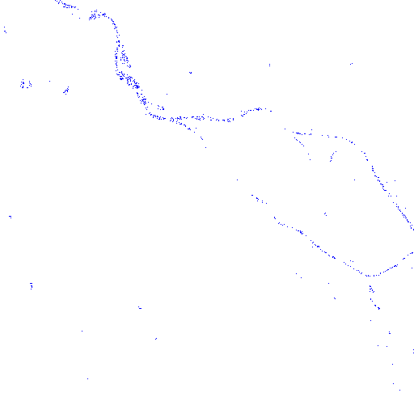
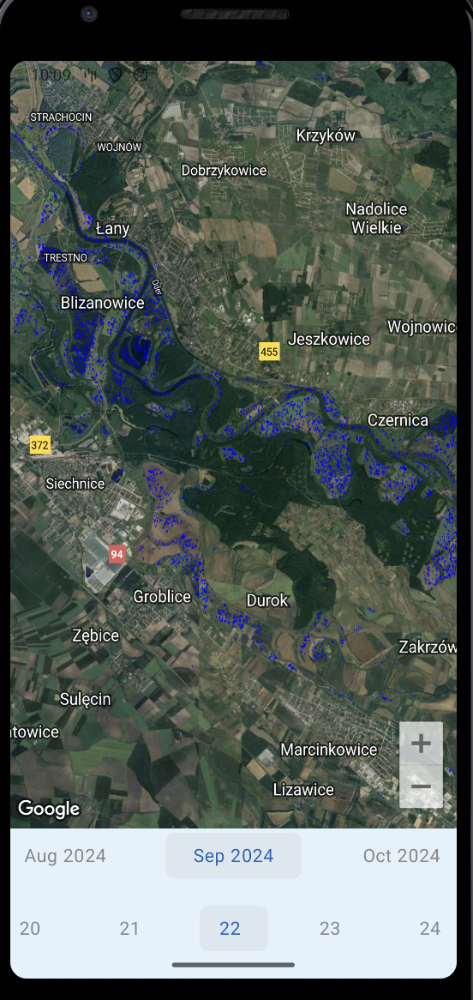

# Mobile Flood Map - Flood Awareness App

## Project Details

The Mobile Flood Map app leverages Sentinel-1 satellite data and AWS Lambda to provide residents and researchers with real-time and historical flood visualizations. Users can track flood events and monitor changes in water levels over time, both for current and past data. The app bridges the gap between research and practical use, transforming complex satellite information into actionable insights that are accessible in a user-friendly format. By democratizing flood data, it empowers communities to better prepare, respond, and learn from past flood events, making it a valuable tool for public safety and awareness.

### [Project Demo](https://drive.google.com/file/d/1PDFRiaHI_K_GO54IyDqAQMOuC1EVPKgz/view?usp=drive_link)

## Project Description

Our project utilizes high-resolution radar-based imagery from the Copernicus Sentinel Hub, an initiative by the European Space Agency (ESA), which offers access to Sentinel-1 Synthetic Aperture Radar (SAR) data. This radar-based data allows for real-time and historical flood visualization, which is crucial for monitoring flood patterns as it is unaffected by cloud cover or adverse weather conditions.

### Satellite Data

We process the radar data using a custom script on the VH and VV bands of the Sentinel-1 satellite to classify flood areas and provide detailed visual insights. This algorithm detects flooded areas by converting Sentinel-1 SAR VV and VH backscatter values to dB, applying a fuzzy membership function to classify water, and filtering out urban areas based on defined thresholds. It is a variation of an algorithm used in the **Sentinel-1 Global Flood Monitoring (DLR)** project.

You can view a sample of our data processing script here: [DLRFloodClassification.js](https://github.com/labwhisper/FloodViewAPI/blob/main/DLRFloodClassification.js).

A sample image data obtained from sentinel hub:



### Backend

To make this data accessible to mobile applications, we designed a serverless backend using **AWS Lambda**. The Lambda function acts as a bridge to the Sentinel Hub API, exposing a simplified endpoint for mobile apps to query flood data. This approach reduces complexity on the client-side, allowing the app to request flood data by simply providing coordinates and a time range. A sample request looks like this:

```json
{
  "coordinates": [[16.9206, 51.0603], [17.1206, 51.0603], [17.1206, 51.1603], [16.9206, 51.1603], [16.9206, 51.0603]],
  "timeRange": { "from": "2024-09-01T00:00:00Z", "to": "2024-09-20T23:59:59Z" }
}
```

More details on the backend can be found in our AWS Lambda code: [get_flood_data.py](https://github.com/labwhisper/FloodViewAPI/blob/main/get_flood_data.py).

### Android App

On the **frontend**, the Android app visualizes this flood data by overlaying Sentinel-1 radar imagery onto Google Maps. This combination provides an intuitive way for users to view the flood extent over familiar satellite imagery. We implemented a user-friendly date selector in the app to easily switch dates and compare the flood data.

Given that Sentinel-1 imagery is captured roughly once every two days or less frequently in some areas, we designed our solution to aggregate images over the selected time period. This means that, for a given date, users see the most recent radar data available within a six-day window to ensure that the most up-to-date information is presented.



### Summary

**Benefits:** Our project aims to bridge the gap between complex satellite data and practical use cases for both residents in flood-prone areas and researchers. By making flood data accessible in a user-friendly format, we hope to provide real-time awareness during flooding events, support decision-making for emergency response, and contribute to post-flood analysis for calculating damage and costs.

## Technologies and Tools Used

- **Languages:** Python (AWS Lambda), Kotlin (Android App), JavaScript (Sentinel hub)
- **Backend:** AWS Lambda (serverless architecture), Sentinel Hub API
- **Frontend:** Android (Google Maps integration)
- **Data Source:** Copernicus Sentinel-1 Satellite Data

## What We Hope to Achieve

We aim to create a comprehensive and easy-to-use tool that transforms complex satellite imagery into actionable insights. This can empower communities, governments, and researchers to better understand and respond to flooding events, ultimately enhancing public safety and supporting long-term flood management strategies.

## Project Repositories

- [Flood Data Processing Script](https://github.com/labwhisper/FloodViewAPI/blob/main/DLRFloodClassification.js)
- [AWS Lambda Backend](https://github.com/labwhisper/FloodViewAPI/blob/main/get_flood_data.py)
